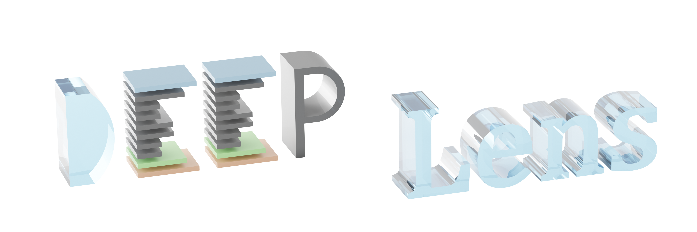
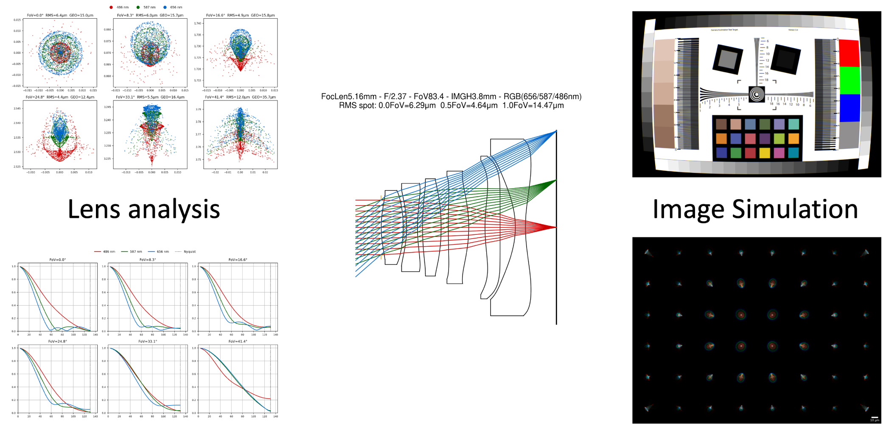
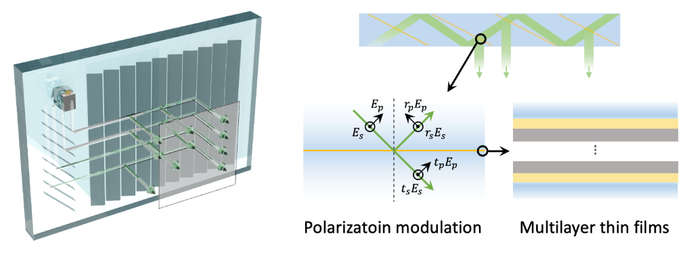

<div align="center">
    
</div>

# DeepLens

DeepLens is a differentiable optical lens simulator for end-to-end computational imaging, supporting multiple optical models (eg., geometric ray tracing, diffractive wave propagation, hybrid ray-wave model, surrogate PSF network).

DeepLens can be used for (1) end-to-end optics-algorithm co-design, (2) gradient-based automated optical design, and (3) synthetic dataset generation via image simulation. DeepLens enables researchers to rapidly prototype and optimize custom optical systems.

<p align="center">
    <a href="https://vccimaging.org/DeepLens/"></a>
    <a href="https://github.com/singer-yang/DeepLens-tutorials"></a>
    <a href="#community"></a>
    <a href="https://pypi.org/project/deeplens-core/"></a>
    <a href="https://deepwiki.com/singer-yang/DeepLens"></a>
</p>

## Features

1. **Differentiable Optics.** DeepLens leverages differentiable optical simulation to enable accurate, efficient gradient calculation for lens inverse design.
2. **Automated Design.** DeepLens enables fully automated optical design via gradient-based and advanced optimization algorithms, shortening the development cycle for a wide range of optical systems (e.g., highly aspherical lenses, metasurfaces, and AR/VR displays).
3. **Multiple Optical Models.** DeepLens supports geometric ray tracing alongside hybrid ray-wave models, neural lens representations, and interpolation-based models.
4. **Image Simulation.** DeepLens delivers photorealistic image rendering with spatially varying, depth-dependent aberrations, closing the sim-to-real gap when combined with [End2end-Imaging](https://github.com/vccimaging/End2endImaging).

Additional features (customizable upon request):

1. **GPU Kernel Acceleration.** Achieves >10x speedup and >90% GPU memory reduction with custom GPU kernels across NVIDIA and AMD platforms, making deployment on local laptops practical.
2. **Polarization Ray Tracing.** Supports polarization ray tracing and inverse design of thin films via [DiffTMM](https://github.com/AI4Optics/DiffTMM).
3. **Non-Sequential Ray Tracing.** Supports a differentiable non-sequential ray tracing model for stray light analysis and optimization.
4. **Distributed Optimization.** Supports distributed simulation and optimization for billion-scale ray tracing and high-resolution (>100k x 100k) diffractive propagation.

## Applications

#### 1. Lens Analysis and Image Simulation

DeepLens supports comprehensive lens analysis (spot diagram, PSF, MTF, distortion, etc.) and photorealistic image simulation with spatially-varying, depth-dependent aberrations.

<div align="center">
    
</div>

#### 2. Automated geometric lens design

Fully automated lens design from scratch with gradient-based optimization and advanced optimization algorithms.

> **Note:** Automated lens design is now actively maintained in the [**AutoLens**](https://github.com/AI4Optics/AutoLens) project. If your focus is automated lens design, we recommend using the AutoLens repo instead, as it receives dedicated updates and improvements for this use case.

[](https://www.nature.com/articles/s41467-024-50835-7) [](https://github.com/AI4Optics/AutoLens)

<div align="center">
    
    
</div>

#### 3. Neural Lens PSF Representation

A surrogate network for efficient lens PSF representation, supporting fast and accurate image simulation with spatially-varying aberrations and defocus.

[](https://ieeexplore.ieee.org/document/10209238) [](https://github.com/vccimaging/Aberration-Aware-Depth-from-Focus)

<div align="center">
    
</div>

#### 4. Hybrid Ray-Wave Optical Model

Differentiable ray-wave optical model for accurate lens aberration and diffraction element simulation, supporting end-to-end refractive-diffractive lens design.

[](https://dl.acm.org/doi/10.1145/3680528.3687640)

<div align="center">
    
</div>

#### 5. Non-sequential Model and Polarization Tracing

Non-sequential polarization tracing to accurately simulate the polarization state of light passing through a geometric waveguide AR display. End-to-end optimization for coating film inverse design targeting the out-coupling eyebox response.

<div align="center">
    
</div>

#### 6. End-to-End Computational Imaging

DeepLens serves as the differentiable optics engine in [**End2endImaging**](https://github.com/vccimaging/End2endImaging), an end-to-end differentiable computational imaging framework. End2endImaging integrates optics, sensor/ISP simulation, and neural reconstruction networks into a single PyTorch computation graph, enabling joint optimization of the entire camera pipeline.

<div align="center">
    
</div>

## Installation

Clone this repo:

```
git clone https://github.com/singer-yang/DeepLens
cd DeepLens
```

Create a conda environment:

```
conda create -n deeplens_env python=3.12
conda activate deeplens_env

# Linux and Mac
pip install torch torchvision
# Windows
pip install torch torchvision --index-url https://download.pytorch.org/whl/cu128

pip install -r requirements.txt
```

or

```
conda env create -f environment.yml -n deeplens_env
```

Run the demo code:

```
python 0_hello_geolens.py
```

DeepLens repo structure:

```
DeepLens/
│
├── deeplens/
│   ├── lens.py             (base lens class)
│   ├── geolens.py          (refractive lens)
│   ├── hybridlens.py       (refractive + diffractive hybrid lens)
│   ├── diffraclens.py      (diffractive lens)
│   ├── defocuslens.py      (circle-of-confusion model)
│   ├── psfnetlens.py       (surrogate lens PSF model)
│   ├── ...
│   ├── geometric_surface/  (refractive and reflective surfaces)
│   ├── diffractive_surface/(diffractive surfaces)
│   ├── phase_surface/      (phase surfaces)
│   ├── light/              (Ray, Wave)
│   ├── material/           (glass/plastic catalogs + refractiveindex.info data)
│   ├── imgsim/             (PSF convolution, monte carlo image simulation)
│   ├── geolens_pkg/        (eval, optim, vis, io mixins)
│   └── surrogate/          (MLP, Siren neural surrogates)
│
├── 0_hello_geolens.py     (code tutorials)
├── ...
└── write_your_own_code.py
```

## Community

Join our [Slack](https://join.slack.com/t/deeplens/shared_invite/zt-2wz3x2n3b-plRqN26eDhO2IY4r_gmjOw) workspace and WeChat Group (singeryang1999) to connect with our core contributors, receive the latest industry updates, and be part of our community. For any inquiries, contact Xinge Yang (xinge.yang@kaust.edu.sa).

## Contribution

We welcome all contributions. To get started, please read our [Contributing Guide](./CONTRIBUTING.md) or check out [open questions](https://github.com/users/singer-yang/projects/2). All project participants are expected to adhere to our [Code of Conduct](./CODE_OF_CONDUCT.md). A list of contributors can be viewed in [Contributors](./CONTRIBUTORS.md) and below:

<a href="https://github.com/singer-yang/DeepLens/graphs/contributors">
  
</a>

## Citation

If you use DeepLens in your research, please cite the paper. See more in [History of DeepLens](./CITATION.md).

```bibtex
@article{yang2024curriculum,
  title={Curriculum learning for ab initio deep learned refractive optics},
  author={Yang, Xinge and Fu, Qiang and Heidrich, Wolfgang},
  journal={Nature communications},
  volume={15},
  number={1},
  pages={6572},
  year={2024},
  publisher={Nature Publishing Group UK London}
}
```
