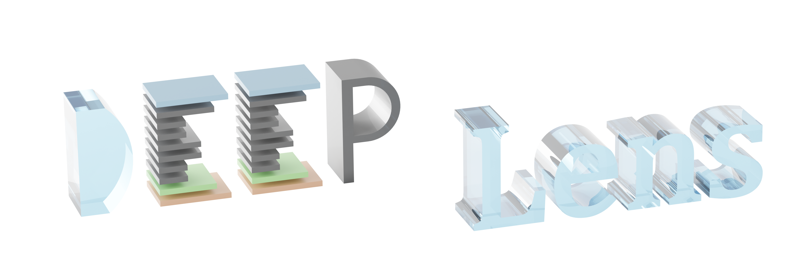
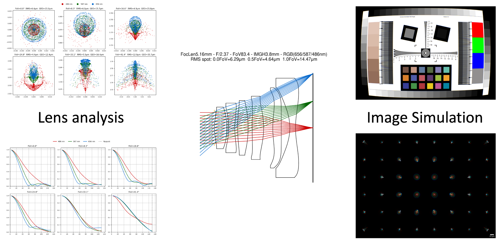
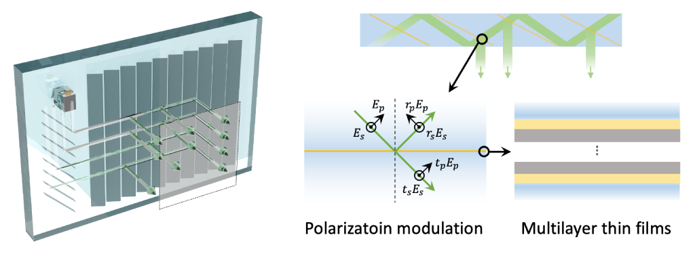

<div align="center">
    
</div>

# DeepLens

DeepLens is a differentiable optical lens simulator for computational imaging, supporting multiple optical models (e.g., ray tracing, wave propagation, ray-wave model, surrogate PSF network). DeepLens can be used for (1) end-to-end optics-algorithm co-design, (2) automated optical design, and (3) image simulation for synthetic datasets.

DeepLens helps researchers and engineers rapidly prototype and design custom optical systems. DeepLens is also **AI-native**: ask your agent to call DeepLens directly, so that its optical reasoning is grounded in real simulation, for example, `use DeepLens to compute the MTF of this lens`.

<p align="center">
    <a href="https://ai4optics.com/deeplens/"></a>
    <a href="https://github.com/singer-yang/DeepLens-tutorials"></a>
    <a href="https://pypi.org/project/deeplens-core/"></a>
    <a href="https://deepwiki.com/vccimaging/DeepLens"></a>
</p>

## News

- **08/14/2025**: DeepLens joins OpenAI's "Codex for Open Source". We will build AI-native optical simulation and design tools.
- **08/09/2025**: We released [DeepO](https://ai4optics.com/deepo/), an AI optical design platform.

## Why DeepLens

Commercial optical design software (Zemax, Code V, etc.) is built for a human designer clicking through a GUI. DeepLens is built for optics that lives inside a PyTorch training loop, where the lens is a set of learnable parameters optimized jointly with a neural network, and gradients flow through the optics.

|                        | DeepLens                                    | Zemax / Code V             |
| ---------------------- | ------------------------------------------- | -------------------------- |
| **Gradients**          | Analytic, via autograd                      | Finite differences         |
| **Python**             | Native (tensors in, tensors out)            | External API bridge        |
| **Hardware**           | GPU (CUDA / ROCm), batched                  | Mostly CPU-bound           |
| **End-to-end co-design** | Optics + ISP + network in one graph        | Not supported              |
| **Agent-scriptable**   | Plain Python, no GUI in the loop            | GUI-centric                |
| **License**            | Free, Apache-2.0                            | Commercial                 |

## Applications

#### 1. Lens Analysis and Image Simulation

DeepLens supports comprehensive lens analysis (spot diagram, PSF, MTF, distortion, etc.) and photorealistic image simulation with spatially varying, depth-dependent aberrations.

<div align="center">
    
</div>

#### 2. Automated Geometric Lens Design

Fully automated lens design from scratch with gradient-based optimization and advanced optimization algorithms.

> **Note:** Automated lens design is now actively maintained in the [**AutoLens**](https://github.com/AI4Optics/AutoLens) project. If your focus is automated lens design, we recommend using the AutoLens repo instead, as it receives dedicated updates and improvements for this use case.

[](https://www.nature.com/articles/s41467-024-50835-7) [](https://github.com/AI4Optics/AutoLens)

<div align="center">
    
    
</div>

#### 3. Neural Lens PSF Representation

A surrogate network for efficient lens PSF representation, supporting fast and accurate image simulation with spatially varying aberrations and defocus.

[](https://ieeexplore.ieee.org/document/10209238) [](https://github.com/vccimaging/Aberration-Aware-Depth-from-Focus)

<div align="center">
    
</div>

#### 4. Hybrid Ray-Wave Optical Model

Differentiable ray-wave optical model for accurate lens aberration and diffraction element simulation, supporting end-to-end refractive-diffractive lens design.

[](https://dl.acm.org/doi/10.1145/3680528.3687640)

<div align="center">
    
</div>

#### 5. Non-Sequential Model and Polarization Tracing

Non-sequential polarization tracing to accurately simulate the polarization state of light passing through a geometric waveguide AR display. End-to-end optimization for coating film inverse design targeting the out-coupling eyebox response.

<div align="center">
    
</div>

#### 6. End-to-End Computational Imaging

DeepLens serves as the differentiable optics engine in [**End2endImaging**](https://github.com/vccimaging/End2endImaging), an end-to-end differentiable computational imaging framework. End2endImaging integrates optics, sensor/ISP simulation, and neural reconstruction networks into a single PyTorch computation graph, enabling joint optimization of the entire camera pipeline.

<div align="center">
    
</div>

## Installation

Clone this repo:

```
git clone https://github.com/vccimaging/DeepLens
cd DeepLens
```

Create a conda environment:

```
conda create -n deeplens_env python=3.12
conda activate deeplens_env

# Linux and Mac
pip install torch torchvision
# Windows
pip install torch torchvision --index-url https://download.pytorch.org/whl/cu128

pip install -r requirements.txt
```

or

```
conda env create -f environment.yml -n deeplens_env
```

Run the demo code:

```
python 0_hello_geolens.py
```

## In-House Extensions

The modules below are implemented and working in house, but are not part of the public release yet. If your project needs one, get in touch and we are happy to grant access or collaborate.

1. **GPU Kernel Acceleration.** Custom kernels for NVIDIA and AMD GPUs: >10x speedup and >90% less GPU memory, enough to run full designs on a laptop.
2. **Polarization Ray Tracing.** Polarization-aware tracing with thin-film inverse design via [DiffTMM](https://github.com/AI4Optics/DiffTMM).
3. **Non-Sequential Ray Tracing.** Differentiable non-sequential tracing for stray light analysis and optimization.
4. **Distributed Optimization.** Multi-GPU simulation for billion-scale ray tracing and >100k x 100k diffractive propagation.

## Community

Join our [Slack](https://join.slack.com/t/deeplens/shared_invite/zt-2wz3x2n3b-plRqN26eDhO2IY4r_gmjOw) workspace and WeChat Group (singeryang1999) to connect with our core contributors, receive the latest industry updates, and be part of our community. For any inquiries, contact Xinge Yang (<xinge.yang@kaust.edu.sa>).

## Contribution

We welcome all contributions. To get started, please read our [Contributing Guide](./CONTRIBUTING.md) or check out [open questions](https://github.com/users/singer-yang/projects/2). All project participants are expected to adhere to our [Code of Conduct](./CODE_OF_CONDUCT.md). A list of contributors can be viewed in [Contributors](./CONTRIBUTORS.md) and below:

<a href="https://github.com/vccimaging/DeepLens/graphs/contributors">
  
</a>

## Citation

If you use DeepLens in your research, please cite the paper. See more in [History of DeepLens](./CITATION.md).

```bibtex
@article{yang2024curriculum,
  title={Curriculum learning for ab initio deep learned refractive optics},
  author={Yang, Xinge and Fu, Qiang and Heidrich, Wolfgang},
  journal={Nature communications},
  volume={15},
  number={1},
  pages={6572},
  year={2024},
  publisher={Nature Publishing Group UK London}
}
```
