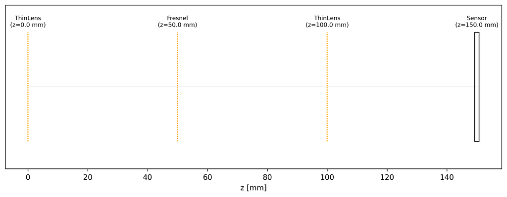
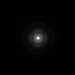

# 4f System

**Script:** [`4f_system.py`](https://github.com/singer-yang/DeepLens/blob/main/4f_system.py)

A 4f optical system relays the input plane to the sensor through two
Fourier-transforming lenses. A diffractive surface at the shared Fourier
(spatial-frequency) plane acts as a frequency-domain filter, so the system PSF
is the inverse Fourier transform of that mask.

```
input(z=-f) --f--> ThinLens(f) --f--> Fresnel DOE --f--> ThinLens(f) --f--> sensor
```

## What it demonstrates

- Building a 4f system with a DOE at the Fourier plane.
- Computing the on-axis PSF with the DOE active vs neutralized (plain 4f relay),
  so the filter's effect is directly visible.

## Run

```bash
python 4f_system.py
```

## Key code

```python
from deeplens import DiffractiveLens
from deeplens.light import ComplexWave

lens = DiffractiveLens(filename="./datasets/lenses/diffraclens/4f_doe.json", device=device)
lens.draw_layout(save_name=f"{save_dir}/4f_layout.png")

# Point at the front focal plane -> forward through the 4f system -> sensor PSF
inp = ComplexWave.point_wave(point=[0, 0, -f], ...)
psf = (lens.forward(inp).u.abs() ** 2)
```

## Results

### Layout



### PSF: plain 4f relay vs Fourier-plane DOE

| Baseline (no filter) | With Fourier-plane DOE |
|---|---|
|  |  |

## See also

- [Diffractive surfaces](diffractive_surfaces.md) · [Hello DiffractiveLens](hello_diffraclens.md)
