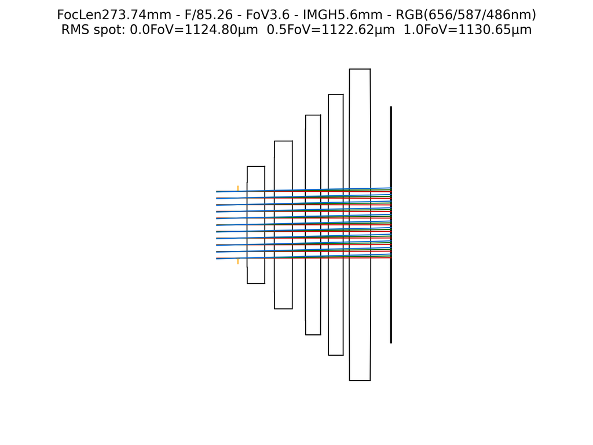

# Automated Lens Design (RMS)

**Script:** [`2_autolens_rms.py`](https://github.com/singer-yang/DeepLens/blob/main/2_autolens_rms.py)

Ab-initio ("from scratch") lens design driven by RMS spot size, which is far
faster than image-based optimization. Implements the curriculum-learning
approach from *Curriculum learning for ab initio deep learned refractive optics*
(Nature Communications 2024).

## What it demonstrates

- Generating a **starting-point** lens automatically from target specs
  (focal length, image height, F-number).
- A curriculum RMS-spot design loop that gradually grows difficulty.

## Run

```bash
python 2_autolens_rms.py
```

## Key code

```python
# Auto-generate a starting point from the design target, then curriculum-design
lens.curriculum_design(
    lrs=[1e-3, 1e-3, 1e-2, 1e-3],
    iterations=5000,
    spp=1024,
    num_ring=16, num_arm=4,
    result_dir=result_dir,
)
lens.write_lens_json(f"{result_dir}/final_lens.json")
lens.analysis(save_name=f"{result_dir}/final_lens")
```

## Results

The auto-generated **starting point** for the target (f ≈ 6.1 mm, image height
5.59 mm, F/1.9). The curriculum design loop is skipped in this documentation
run; the full script optimizes this starting point into a corrected lens.



## See also

- [GeoLens design](design_geolens.md) · [Hello GeoLens](hello_geolens.md)
