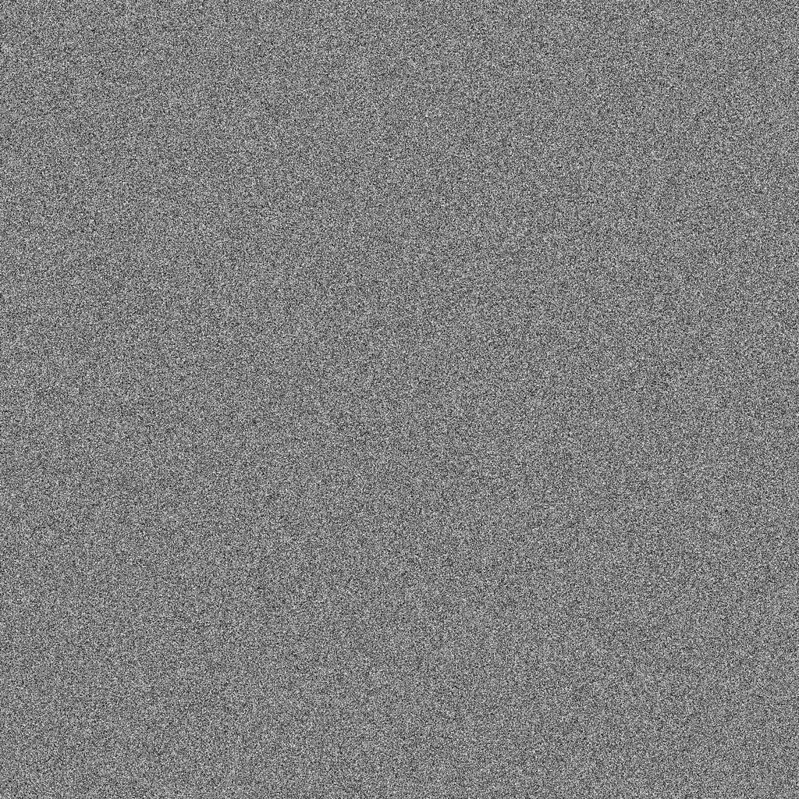
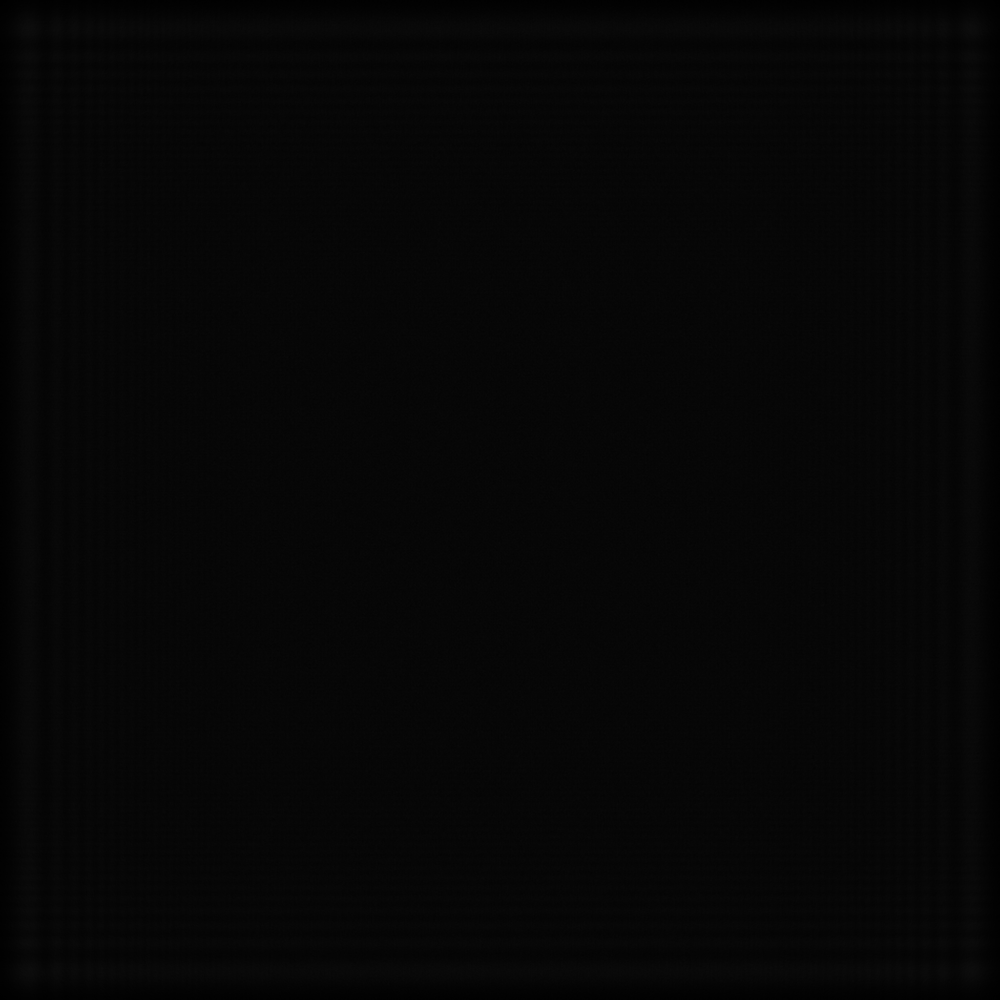
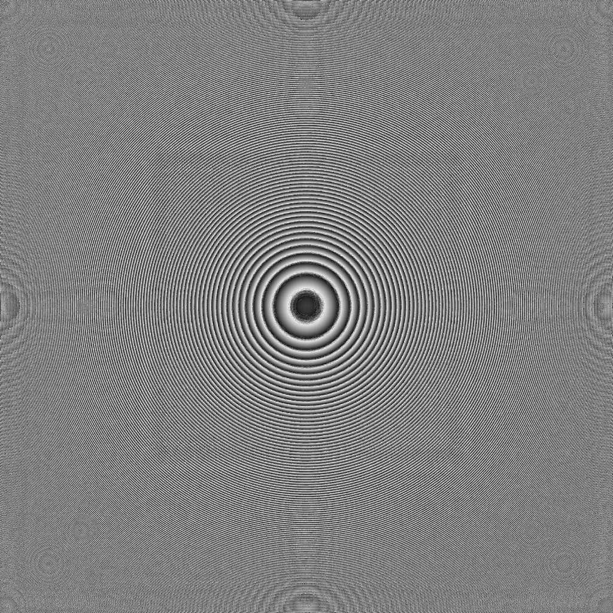
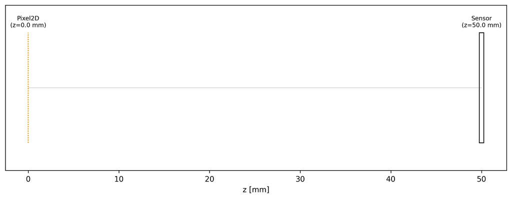

# DiffractiveLens Design

**Script:** [`1_design_diffraclens.py`](https://github.com/singer-yang/DeepLens/blob/main/1_design_diffraclens.py)

Optimize a `Pixel2D` diffractive phase plate (each pixel an independent phase
value) from **random phase** so that an on-axis collimated beam focuses to a
tight spot on the sensor. The DOE learns a lens-like Fresnel profile from
scratch.

## What it demonstrates

- A fully differentiable wave-optics design loop with band-limited ASM.
- A `PSFStrehlLoss` (peak-intensity) objective that drives a sharp focal spot.
- The sampling rule that lets the full aperture focus.

## Run

```bash
python 1_design_diffraclens.py
```

## Key code

```python
import torch
from deeplens import DiffractiveLens
from deeplens.loss import PSFStrehlLoss

# 5 mm-aperture Pixel2D DOE at 2 µm pitch, sensor 50 mm behind (f/10).
lens = DiffractiveLens(filename="./datasets/lenses/diffraclens/pixel2d.json",
                       device="cuda", dtype=torch.float64)
optimizer = lens.get_optimizer(lr=0.1)
loss_fn = PSFStrehlLoss()  # maximize the on-axis center-pixel intensity

on_axis_inf = [0.0, 0.0, float("-inf")]
for _ in range(1000):
    psf = lens.psf(points=on_axis_inf)               # full sensor-resolution PSF
    strehl = loss_fn(psf.unsqueeze(0).repeat(3, 1, 1))  # expects RGB [3, ks, ks]
    loss = -strehl                                   # maximize -> minimize negative
    optimizer.zero_grad(); loss.backward(); optimizer.step()
```

!!! note "Sampling rule"
    To focus the full aperture, the marginal-ray spatial frequency
    `(D/2)/(λf)` must stay below the grid Nyquist `1/(2·ps)`. At `f=50 mm`,
    `D=5 mm`, `λ=0.55 µm`, a `2 µm` pitch keeps 91 cyc/mm well below the
    250 cyc/mm Nyquist, giving a diffraction-limited spot `λf/D ≈ 5.5 µm`.

## Results

### Initial (random phase)

| Phase (init) | PSF (init) |
|---|---|
|  |  |

### Optimized

| Phase (final) | PSF (final) |
|---|---|
|  |  |

The random phase converges to a clean **Fresnel zone plate** and the diffuse
field collapses to a sharp central peak.

### Layout



## See also

- [Hello DiffractiveLens](hello_diffraclens.md)
- API: [`DiffractiveLens`](../api/optics.md#lens-models)
