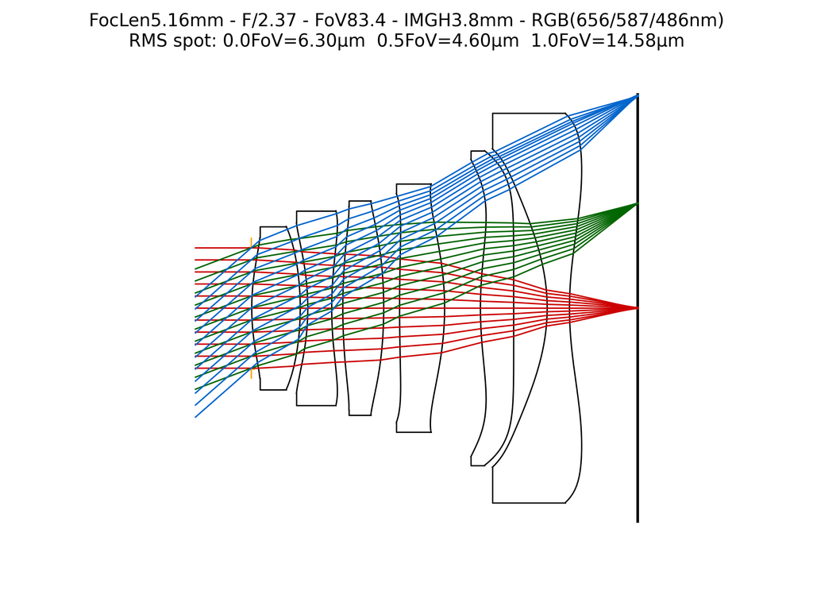

# GeoLens Design

**Script:** [`1_design_geolens.py`](https://github.com/singer-yang/DeepLens/blob/main/1_design_geolens.py)

Optimize a refractive lens by gradient descent on its surface parameters using
the built-in curriculum loop, with an RMS-spot objective and manufacturability
regularizers.

## What it demonstrates

- Loading a starting lens and running `lens.optimize(...)` (curriculum learning).
- Comparing the optical analysis before and after optimization.

## Run

```bash
python 1_design_geolens.py
```

## Key code

```python
from deeplens import GeoLens

lens = GeoLens(filename="./datasets/lenses/cellphone/cellphone80deg.json")
lens.analysis(save_name=f"{result_dir}/initial")

lens.optimize(
    lrs=[1e-3, 1e-4, 1e-1, 1e-4],
    iterations=10000,
    test_per_iter=100,
    sample_more_off_axis=True,
    result_dir=result_dir,
)

lens.write_lens_json(f"{result_dir}/final_lens.json")
lens.analysis(save_name=f"{result_dir}/final_lens")
```

## Results

The figure below is the **starting-point** analysis produced before the
optimization loop (the design loop itself is skipped in this documentation run).
Running the full script optimizes the surfaces and writes the corresponding
`final_lens` analysis.



## See also

- [Hello GeoLens](hello_geolens.md) · [Automated lens design](autolens_rms.md)
- API: [`GeoLensOptim`](../api/optics.md#lens-models)
