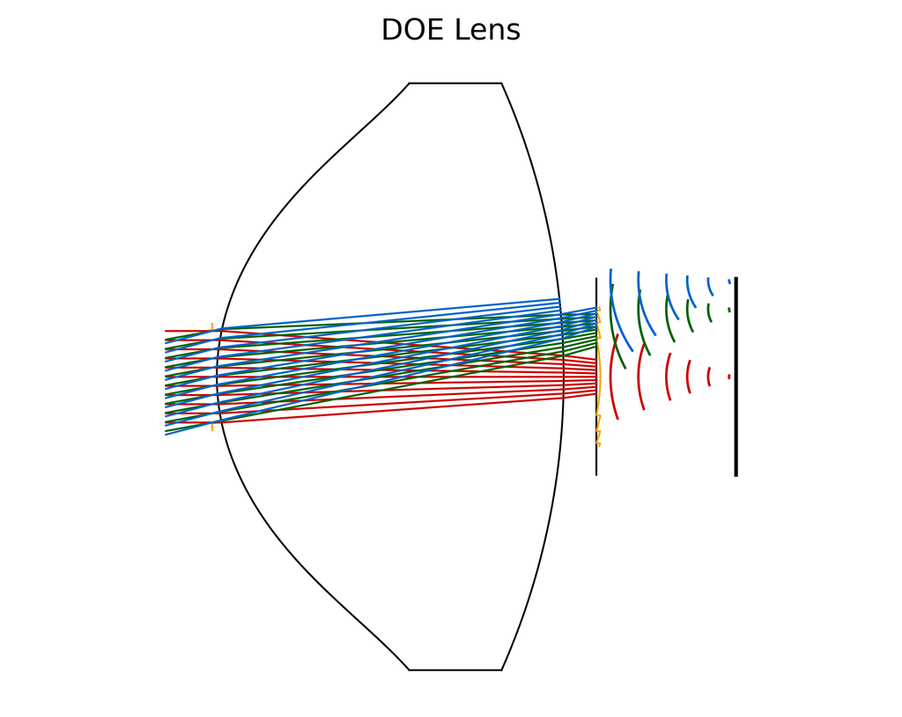
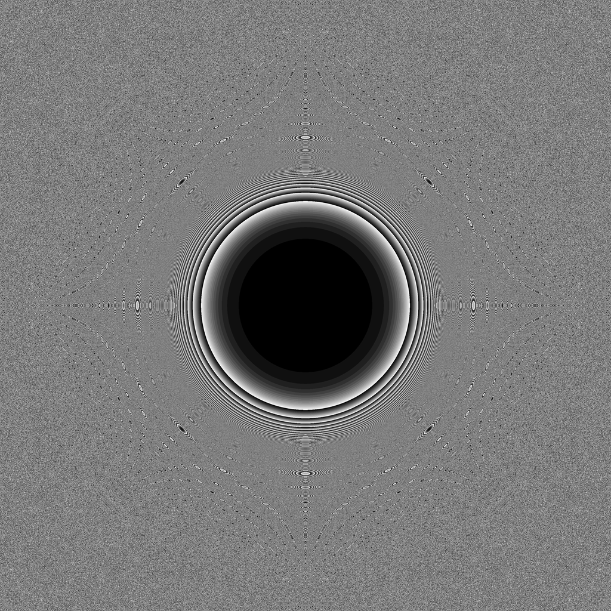
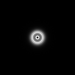

# HybridLens Design

**Script:** [`1_design_hybridlens.py`](https://github.com/singer-yang/DeepLens/blob/main/1_design_hybridlens.py)

End-to-end design of a hybrid refractive–diffractive lens with the differentiable
ray–wave model: optimize the DOE phase (and optionally the refractive surfaces)
against an imaging objective.

## What it demonstrates

- Building a `HybridLens` and optimizing its DOE with the ray–wave PSF.
- Periodic analysis snapshots (layout, DOE phase, PSF) during the design loop.

## Run

```bash
python 1_design_hybridlens.py
```

## Key code

```python
import torch
from deeplens import HybridLens

lens = HybridLens(filename="./datasets/lenses/hybridlens/a489_doe.json",
                  dtype=torch.float64)

iterations = 1000
for i in range(iterations + 1):
    # ... compute ray-wave PSF, imaging loss, backprop, optimizer step ...
    if i % save_every == 0:
        lens.write_lens_json(f"{result_dir}/lens_iter{i}.json")
        lens.analysis(save_name=f"{result_dir}/lens_iter{i}.png")
```

## Results

Snapshots at the start of the design loop (the optimization itself is skipped in
this documentation run):

| Layout | DOE phase | PSF |
|---|---|---|
|  |  |  |

## See also

- [Hello HybridLens](hello_hybridlens.md) · [Pupil field](pupil_field.md)
- API: [`HybridLens`](../api/optics.md#lens-models)
