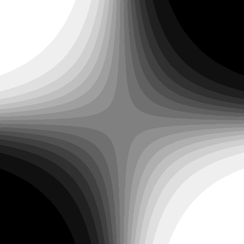
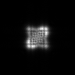
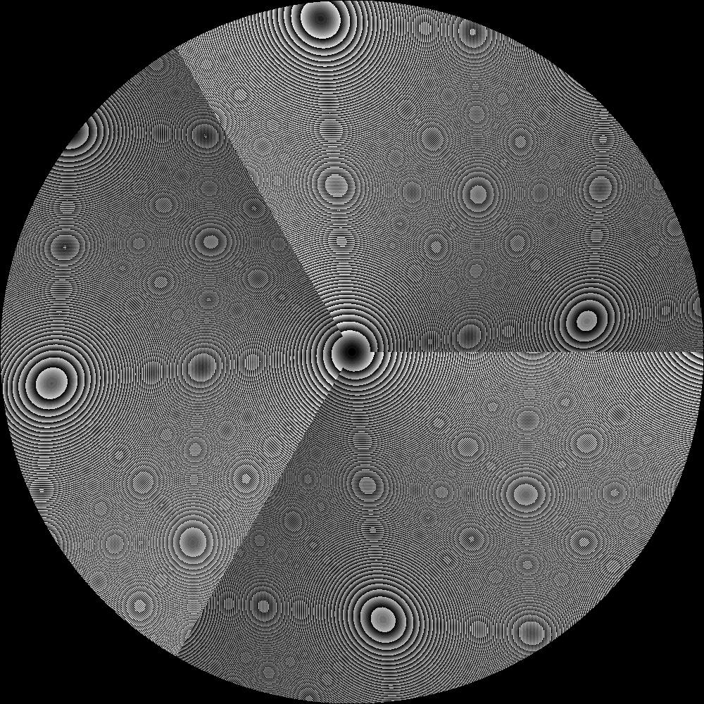
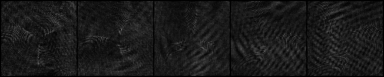
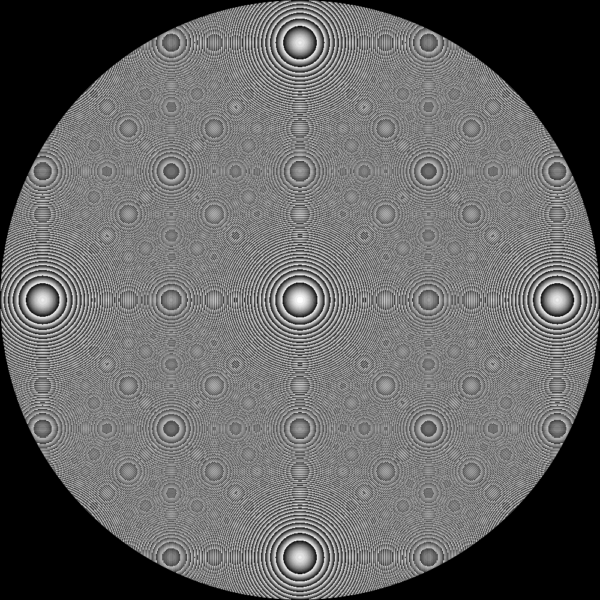
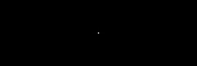

# Diffractive Surfaces

**Script:** [`9_diffractive_surfaces.py`](https://github.com/singer-yang/DeepLens/blob/main/9_diffractive_surfaces.py)

Demonstrates three paper-based diffractive surface parameterizations. For each,
the script saves the design-wavelength phase map and the resulting PSF.

## What it demonstrates

- **Rank1** (Sun et al., CVPR 2020): a low-rank height map
  `h = h_max · sigmoid(V @ Qᵀ)`; a saddle initialization gives an anisotropic,
  streak-like PSF.
- **DiffractedRotation** (Jeon et al., TOG 2019): per-angle blazed Fresnel
  sectors forming an N-fold "spiral" phase map.
- **RotationallySymmetric** (Dun et al., Optica 2020): a free-form 1-D radial
  profile.

## Run

```bash
python 9_diffractive_surfaces.py
```

## Key code

```python
from deeplens import DiffractiveLens

for cfg in ["rank1.json", "diffracted_rotation.json", "rotational_symmetric.json"]:
    doe = DiffractiveLens(filename=f"./datasets/lenses/diffraclens/{cfg}", device=DEVICE)
    doe.surfaces[0].draw_phase_map(save_name=...)   # design-wavelength phase
    psf = doe.psf(points=[0.0, 0.0, float("-inf")]) # PSF
```

## Results

### Rank1 (Sun et al., CVPR 2020)

| Phase | PSF |
|---|---|
|  |  |

### DiffractedRotation (Jeon et al., TOG 2019)

| Phase | PSF sweep |
|---|---|
|  |  |

### RotationallySymmetric (Dun et al., Optica 2020)

| Phase | PSF |
|---|---|
|  |  |

## See also

- [Phase Surfaces API](../api/optics.md#phase-surfaces) · [4f system](4f_system.md)
