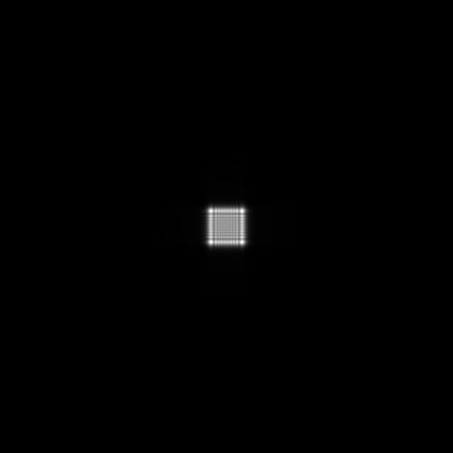
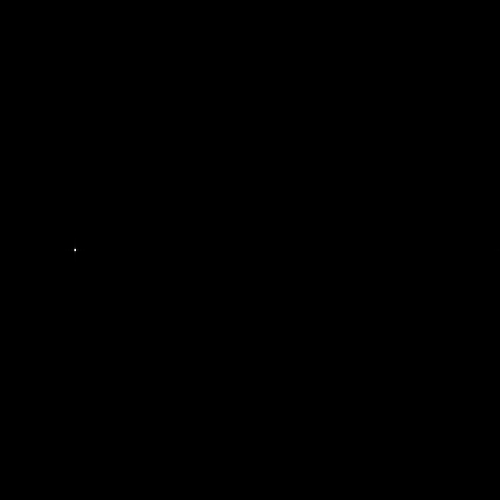
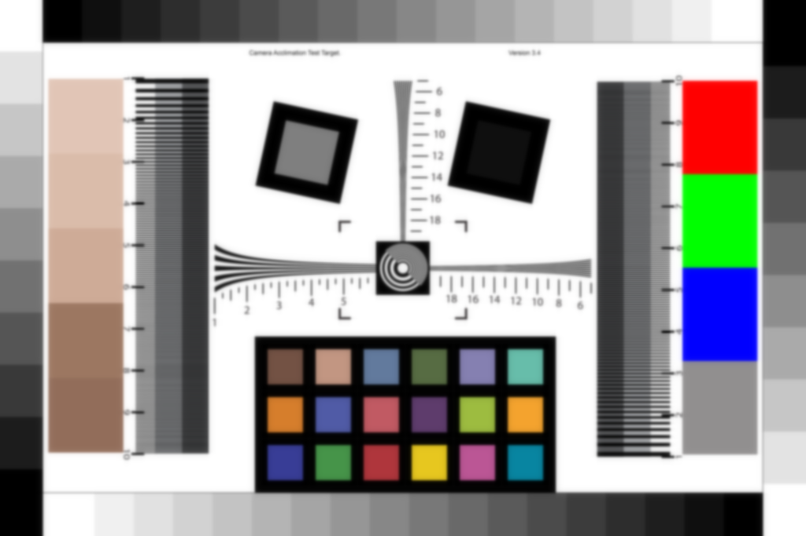

# Hello DiffractiveLens

**Script:** [`0_hello_diffraclens.py`](https://github.com/singer-yang/DeepLens/blob/main/0_hello_diffraclens.py)

A pure wave-optics lens built from a diffractive phase plate. The complex
wavefront is propagated to the sensor with the band-limited Angular Spectrum
Method (ASM). Runs in `float64` for phase accuracy.

## What it demonstrates

- Loading a `DiffractiveLens` from JSON (here a Fresnel phase plate).
- Computing the PSF for an object at infinity, at finite depth, and off-axis.
- Wave-optics image rendering through the diffractive lens.

## Run

```bash
python 0_hello_diffraclens.py
```

## Key code

```python
import torch
from deeplens import DiffractiveLens

lens = DiffractiveLens(filename="./datasets/lenses/diffraclens/fresnel.json")  # float64

psf_inf = lens.psf(points=[0.0, 0.0, float("-inf")])   # collimated, on-axis
psf_near = lens.psf(points=[0.0, 0.0, -200.0])         # finite depth
psf_off = lens.psf(points=[0.0, 0.7, float("-inf")])   # off-axis
img_render = lens.render(img, depth=-200.0)
```

## Results

| PSF (object at ∞) | PSF (near) | PSF (off-axis) |
|---|---|---|
|  |  |  |

### Rendered image



!!! note
    A single-element Fresnel plate at a coarse pixel pitch is undersampled at the
    focal plane, so the PSF shows a residual diffraction "ghost" background. See
    [DiffractiveLens design](design_diffraclens.md) for the sampling rule that
    governs a clean focus.

## See also

- API: [`DiffractiveLens`](../api/optics.md#lens-models), [`ComplexWave`](../api/optics.md#light-representations)
