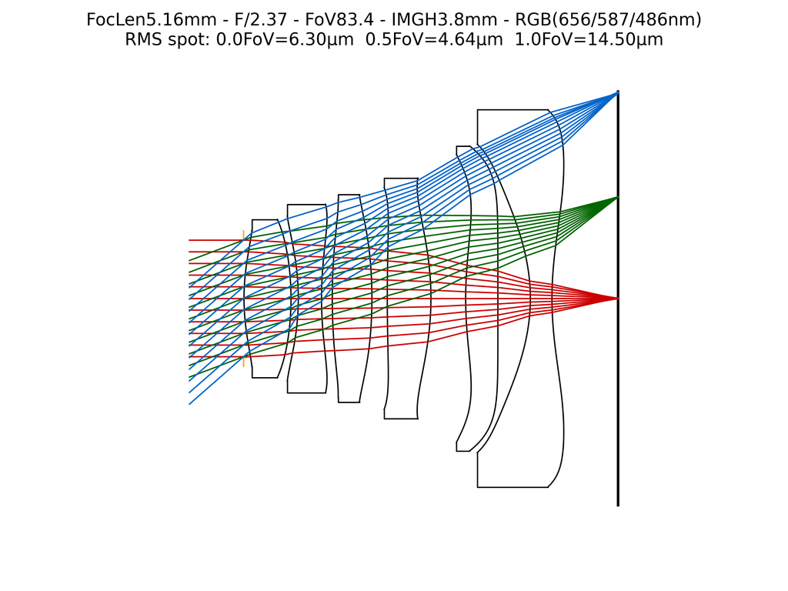
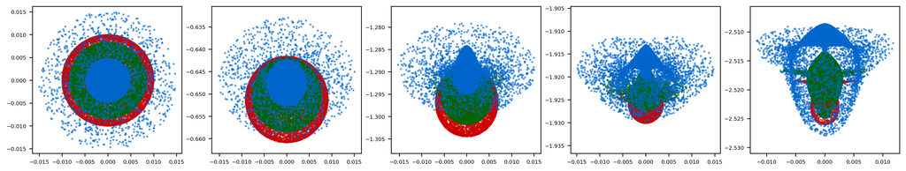
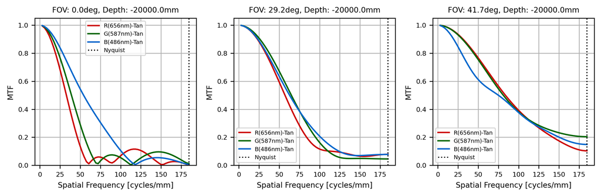
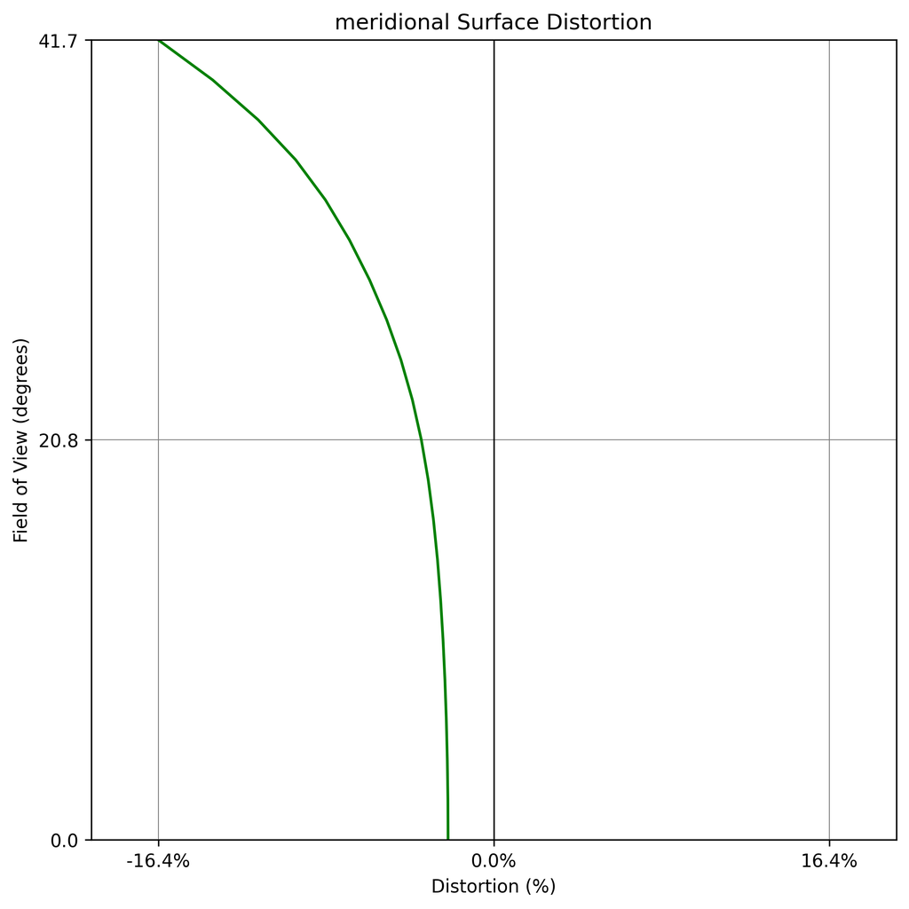
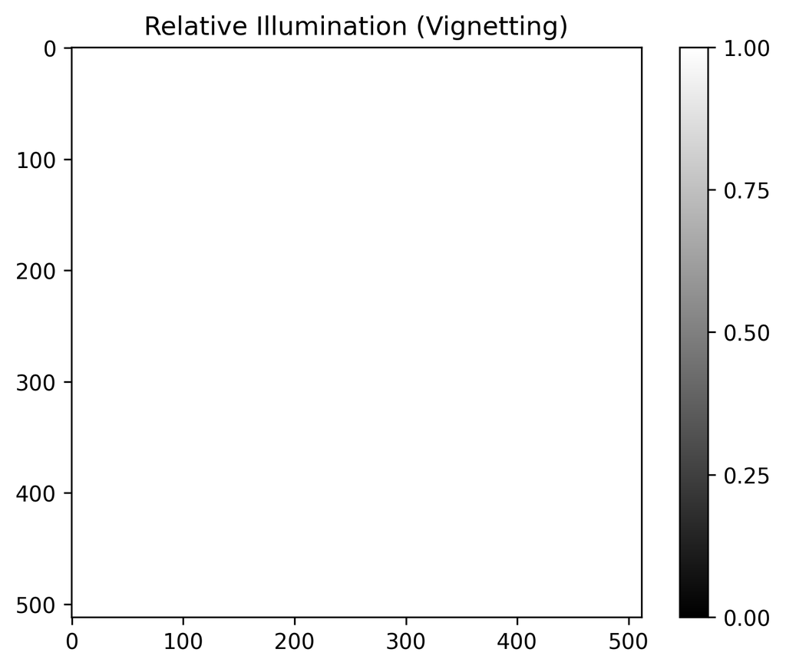
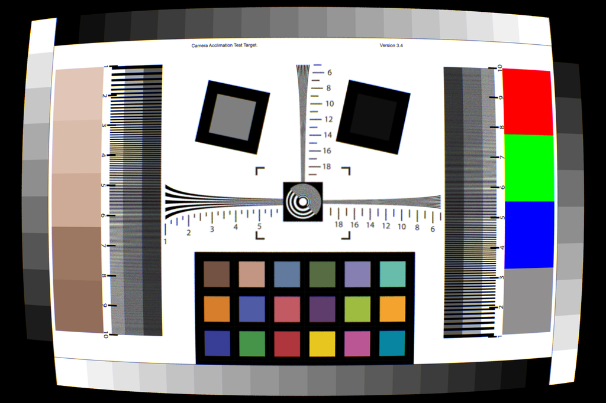

# Hello GeoLens

**Script:** [`0_hello_geolens.py`](https://github.com/singer-yang/DeepLens/blob/main/0_hello_geolens.py)

The fastest end-to-end tour of the geometric-lens workflow: load a lens, run the
classical optical analyses, and render an image through it with both ray tracing
and PSF-map convolution.

## What it demonstrates

- Loading a `GeoLens` from JSON (Zemax `.zmx` and Code V are also supported).
- The classical evaluation plots: layout, spot diagram, MTF, distortion, and
  relative illumination (vignetting).
- Two rendering paths: per-ray `ray_tracing` and spatially-varying `psf_map`.

## Run

```bash
python 0_hello_geolens.py
```

## Key code

```python
from deeplens import GeoLens

lens = GeoLens(filename="./datasets/lenses/cellphone/cellphone80deg.json")

lens.draw_layout(filename="./lens.png")
lens.analysis_spot()
lens.draw_spot_radial(save_name="./lens_spot.png")
lens.draw_mtf(depth_list=[lens.obj_depth], save_name="./lens_mtf.png")
lens.draw_distortion_radial(save_name="./lens_distortion.png")
lens.draw_vignetting(filename="./lens_vignetting.png", depth=lens.obj_depth)

# Image simulation at the sensor resolution
lens.set_sensor_res((3000, 2000))
img_ray = lens.render(img, depth=DEPTH, method="ray_tracing", spp=8)
img_psf = lens.render(img, depth=DEPTH, method="psf_map", psf_grid=(30, 20))
```

## Results

### Lens layout



### Optical analysis

| Spot diagram | MTF |
|---|---|
|  |  |

| Distortion | Vignetting |
|---|---|
|  |  |

### Image simulation

| Ray tracing | PSF map |
|---|---|
|  |  |

## See also

- API: [`GeoLens`](../api/optics.md#lens-models)
- [GeoLens design](design_geolens.md) · [Automated lens design](autolens_rms.md)
