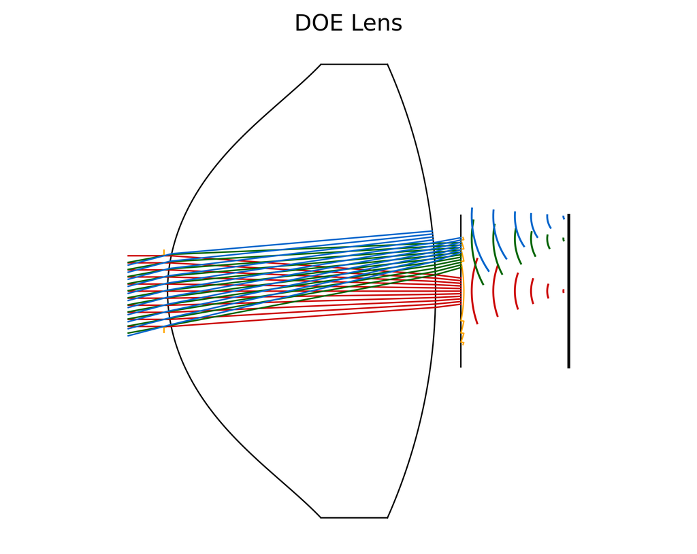

# Hello HybridLens

**Script:** [`0_hello_hybridlens.py`](https://github.com/singer-yang/DeepLens/blob/main/0_hello_hybridlens.py)

A hybrid refractive–diffractive lens: coherent ray tracing computes the complex
wavefront at the DOE plane (capturing all geometric aberrations), the DOE phase
modulates it, and ASM propagation carries it to the sensor. Runs in `float64`.

## What it demonstrates

- Loading a `HybridLens` from a JSON file that contains both refractive surfaces
  and a `DOE` block.
- The coherent ray-trace → DOE modulation → ASM propagation pipeline.
- Rendering an image through the hybrid system.

## Run

```bash
python 0_hello_hybridlens.py
```

## Key code

```python
import torch
torch.set_default_dtype(torch.float64)  # required for accurate phase tracing
from deeplens import HybridLens

lens = HybridLens(filename="./datasets/lenses/hybridlens/a489_doe.json")
lens.draw_layout(save_name="./hello_hybridlens_layout.png")

# Coherent ray tracing + DOE modulation + ASM propagation
psf = lens.psf(points=[0.0, 0.0, -10000.0], wvln=0.589, spp=1_000_000)
img_render = lens.render(img, depth=-10000.0)

print(f"Focal length: {lens.geolens.foclen:.2f} mm")  # refractive part via .geolens
```

## Results

| Lens layout | Rendered image |
|---|---|
|  |  |

## See also

- API: [`HybridLens`](../api/optics.md#lens-models)
- [HybridLens design](design_hybridlens.md) · [Multi-order diffraction](multi_order.md)
