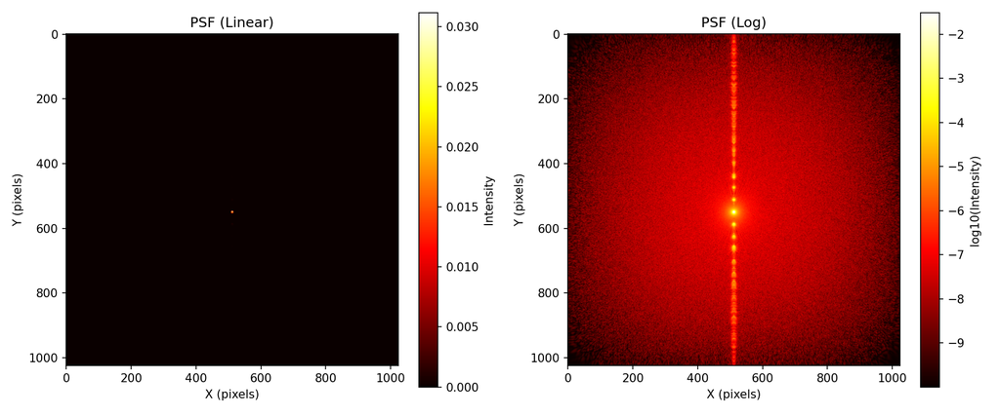
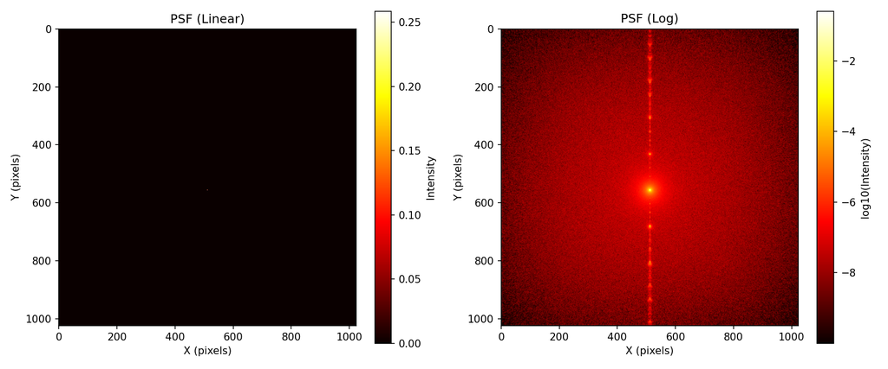
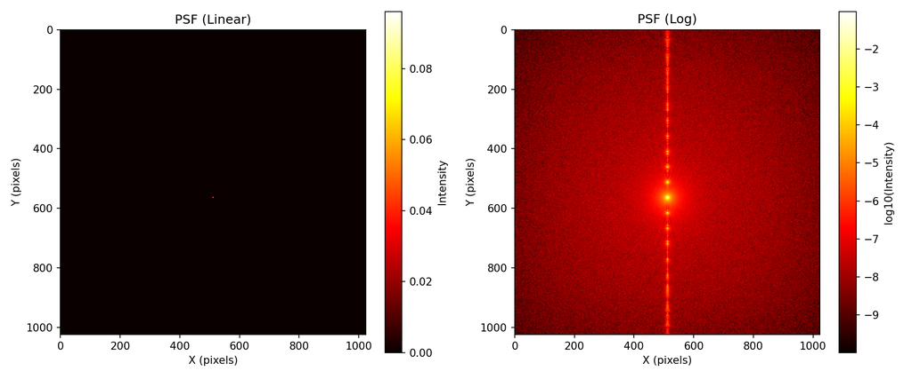
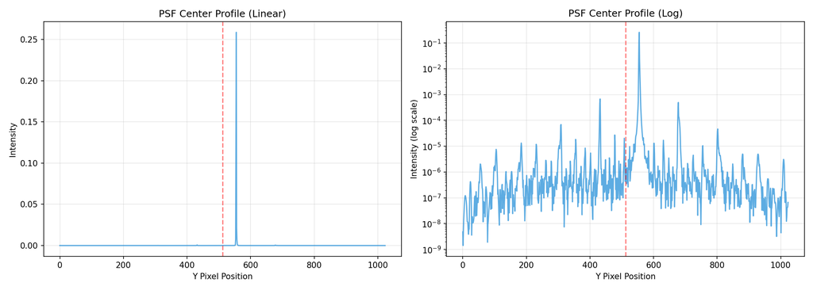

# Multi-order Diffraction

**Script:** [`8_multi_order_diffraction.py`](https://github.com/singer-yang/DeepLens/blob/main/8_multi_order_diffraction.py)

Visualize multi-order diffraction in the PSF of a hybrid refractive–diffractive
lens. A ray-tracing model (e.g. Zemax) traces one diffraction order at a time;
the ray–wave model carries **all orders** in the wavefront at once, so a single
PSF computation includes every order's contribution.

## What it demonstrates

- Computing the PSF of a grating-DOE hybrid lens with the ray–wave model.
- The wavelength dependence of multi-order diffraction (R/G/B).

## Run

```bash
python 8_multi_order_diffraction.py
```

## Key code

```python
import torch
from deeplens import HybridLens

lens = HybridLens(filename="./datasets/lenses/hybridlens/a489_grating.json",
                  dtype=torch.float64)

for wvln in [0.48, 0.55, 0.65]:
    psf = lens.psf(points=[0.0, 0.0, -10000.0], wvln=wvln, spp=1_000_000)
    analyze_psf(psf, save_name=f"./psf_{wvln}")
```

## Results

PSF at three wavelengths — the diffraction orders shift with wavelength:

| λ = 0.48 µm | λ = 0.55 µm | λ = 0.65 µm |
|---|---|---|
|  |  |  |

### Center-line profile (λ = 0.55 µm)



## See also

- [Hello HybridLens](hello_hybridlens.md) · [Diffractive surfaces](diffractive_surfaces.md)
