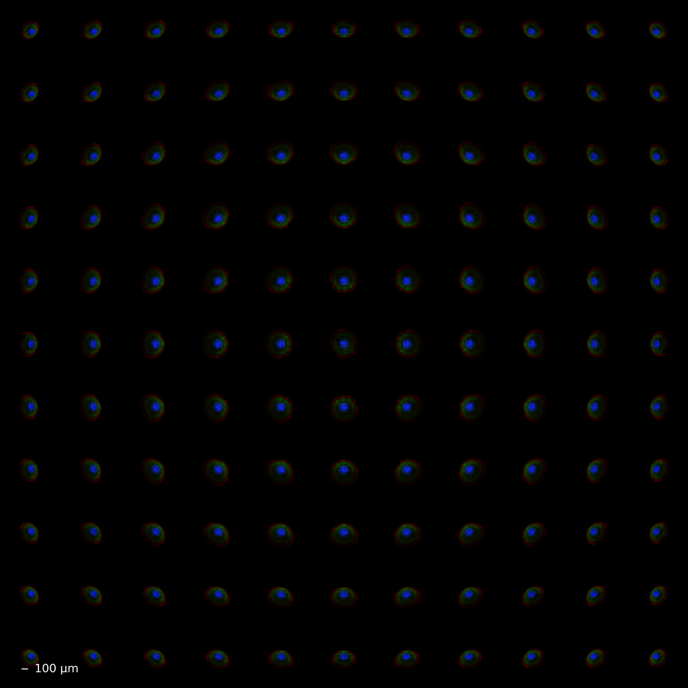
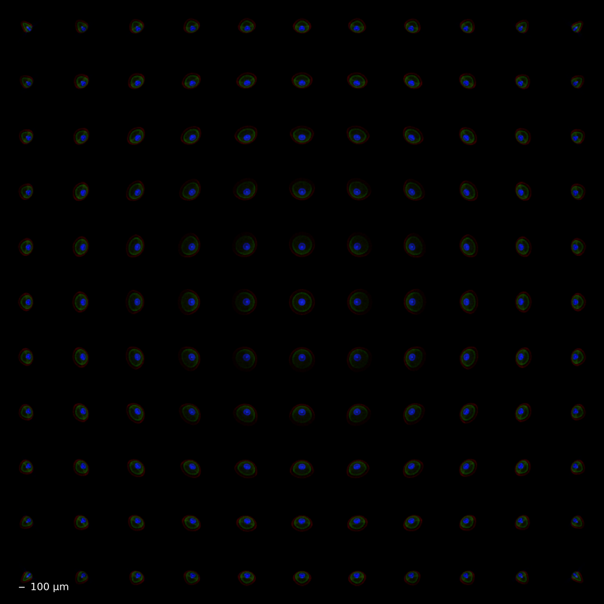
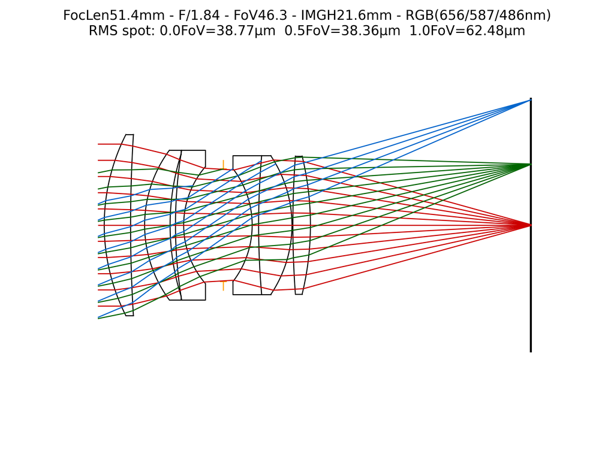

# PSF Network (Neural Surrogate)

**Script:** [`3_psf_net.py`](https://github.com/singer-yang/DeepLens/blob/main/3_psf_net.py)

Represent a lens's spatially-varying PSF with a neural network (`PSFNetLens`).
The surrogate predicts the RGB PSF at any `(fov, depth, focus distance)`,
accelerating PSF evaluation versus ray tracing. From
*Aberration-Aware Depth-from-Focus* (IEEE TPAMI 2023).

## What it demonstrates

- Wrapping a `GeoLens` with an MLP-based PSF predictor.
- Comparing the **network-predicted** PSF map against the **ray-traced** PSF map.
- Loading a pretrained checkpoint (and training from scratch with `train_psfnet`).

## Run

```bash
# Download the pretrained model from the releases page first:
#   https://github.com/vccimaging/DeepLens/releases/
python 3_psf_net.py
```

## Key code

```python
from deeplens import PSFNetLens

psfnet_lens = PSFNetLens(
    in_chan=3, psf_chan=3,
    lens_path="./datasets/lenses/camera/ef50mm_f1.8.json",
    model_name="mlpconv", kernel_size=128,
)
psfnet_lens.load_net("./ckpts/psfnet/PSFNet_ef50mm_f1.8_ps10um.pth")

psfnet_lens.refocus(-1200)
psfnet_lens.draw_psf_map(save_name="./psf_map_net.png", grid=(11, 11), depth=-1500)
psfnet_lens.lens.draw_psf_map(save_name="./psf_map_lens.png", grid=(11, 11), depth=-1500)

# Train from scratch:
# psfnet_lens.train_psfnet(iters=10000, bs=128, lr=5e-5, result_dir=result_dir)
```

## Results

Network-predicted vs ray-traced PSF maps (these are drawn from the pretrained
checkpoint, before any training):

| PSF map — network | PSF map — ray tracing |
|---|---|
|  |  |

### Underlying lens



## See also

- API: [`PSFNetLens`](../api/optics.md#lens-models), [Surrogate Networks](../api/network.md)
