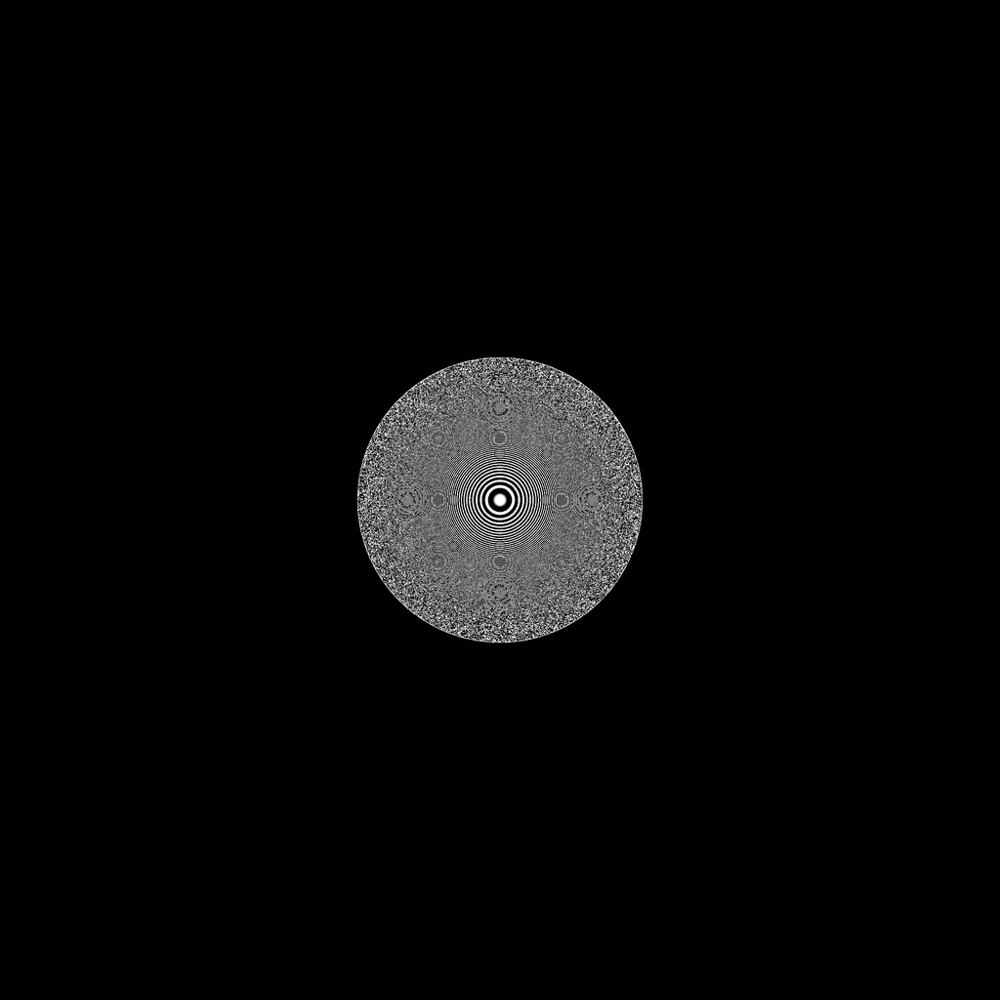
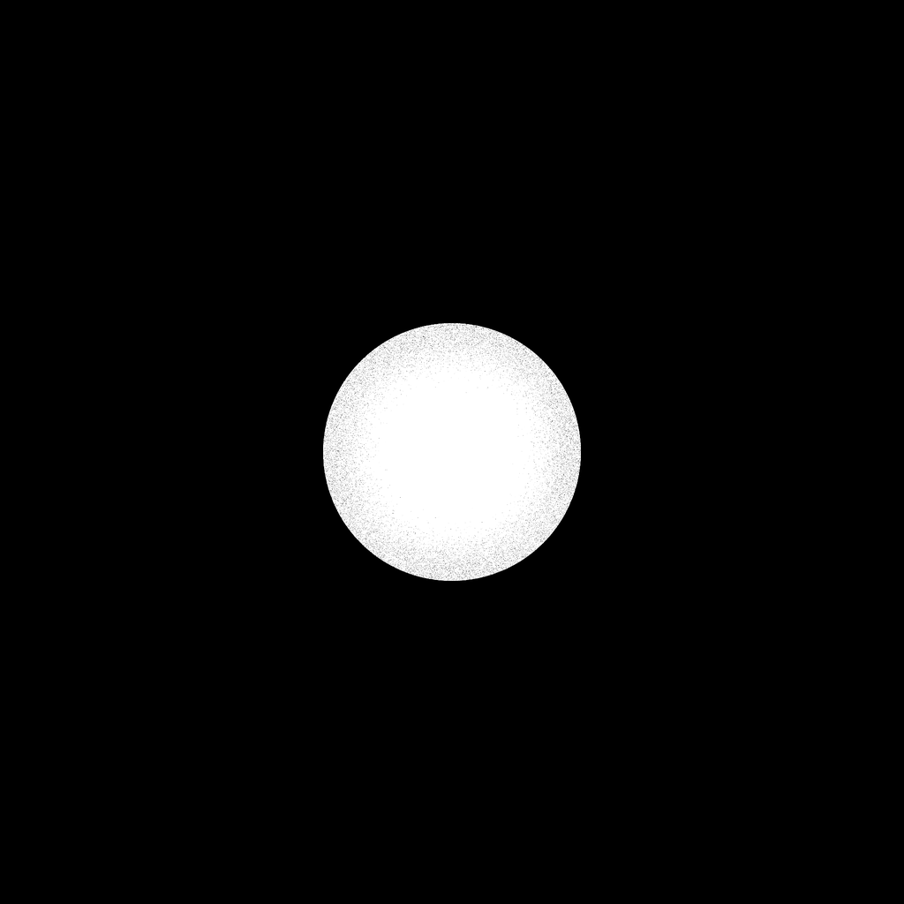
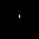
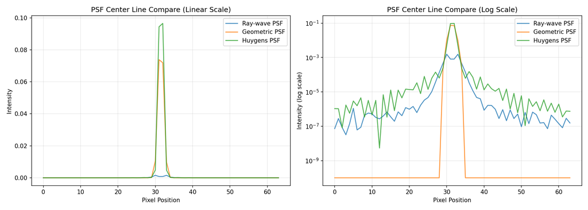

# Pupil Field & Wavefront

**Script:** [`5_pupil_field.py`](https://github.com/singer-yang/DeepLens/blob/main/5_pupil_field.py)

Compute the exit-pupil field (complex wavefront) of a refractive lens for a point
object by **coherent ray tracing**, and compare PSFs computed by different
models. Unlike commercial tools that interpolate a low-frequency wavefront,
DeepLens computes the wavefront directly, so it stays accurate for
high-frequency aberration. From the differentiable ray–wave model
(SIGGRAPH Asia 2024).

## What it demonstrates

- Extracting the exit-pupil amplitude and phase (wavefront) via coherent ray tracing.
- Comparing the PSF from the ray–wave (coherent), incoherent ray-traced, and
  Huygens models, including a center-line cross-section.

## Run

```bash
python 5_pupil_field.py
```

## Key code

```python
from deeplens import GeoLens

lens = GeoLens(filename="./datasets/lenses/cellphone/cellphone68deg.json")
lens.set_sensor_res((8000, 8000))

wavefront, _ = lens.pupil_field(points=point, spp=20_000_000)
save_image(wavefront.angle(), "./wavefront_phase.png")  # phase
save_image(torch.abs(wavefront), "./wavefront_amp.png") # amplitude
```

!!! note
    The figures below were generated with reduced sampling (`spp`, sensor
    resolution) for documentation speed; the committed script uses the full
    high-resolution settings.

## Results

| Wavefront phase | Wavefront amplitude |
|---|---|
|  |  |

| Ray–wave PSF | Model comparison (center line) |
|---|---|
|  |  |

## See also

- [HybridLens design](design_hybridlens.md) · API: [`ComplexWave`](../api/optics.md#light-representations)
